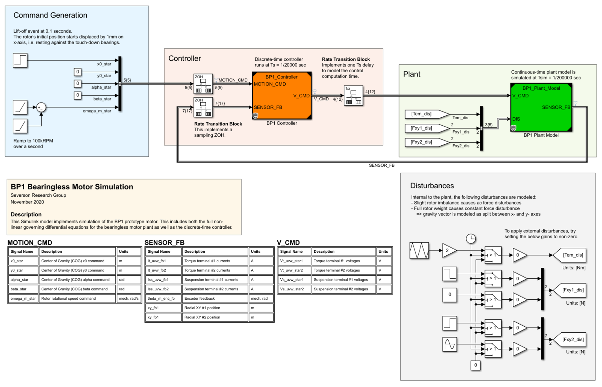
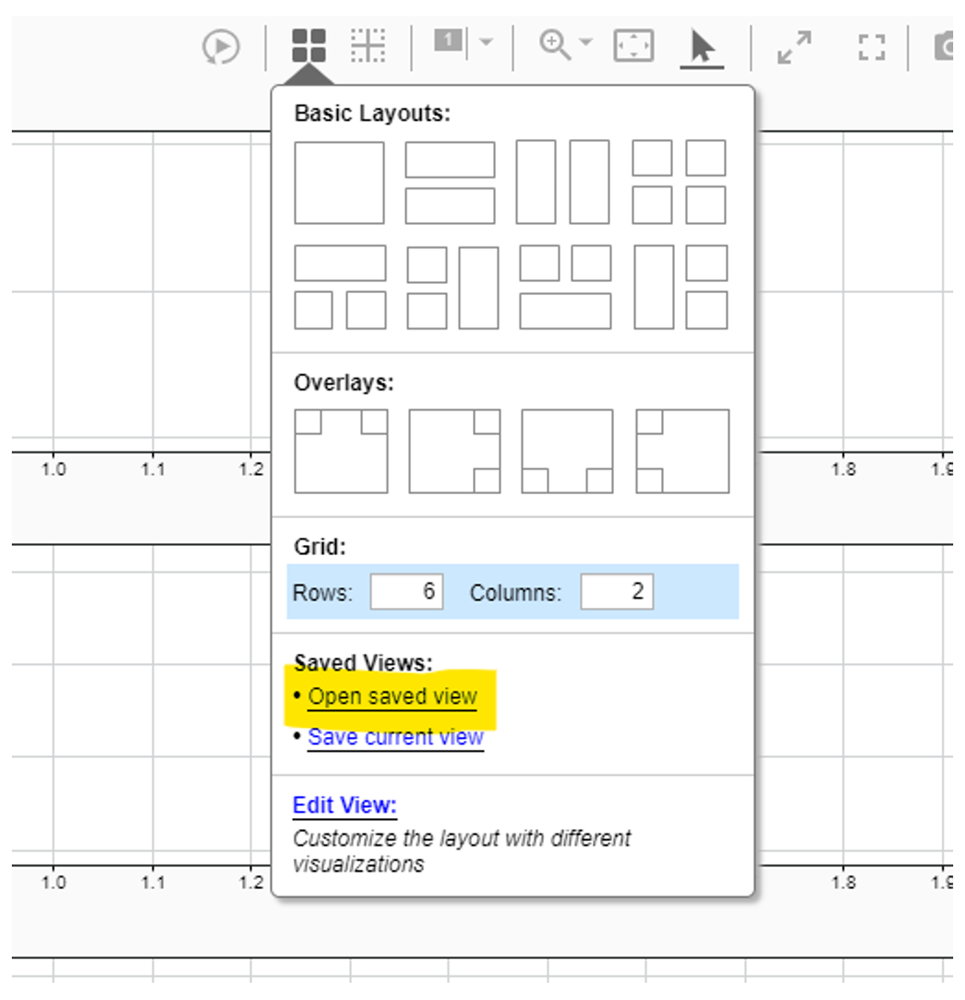
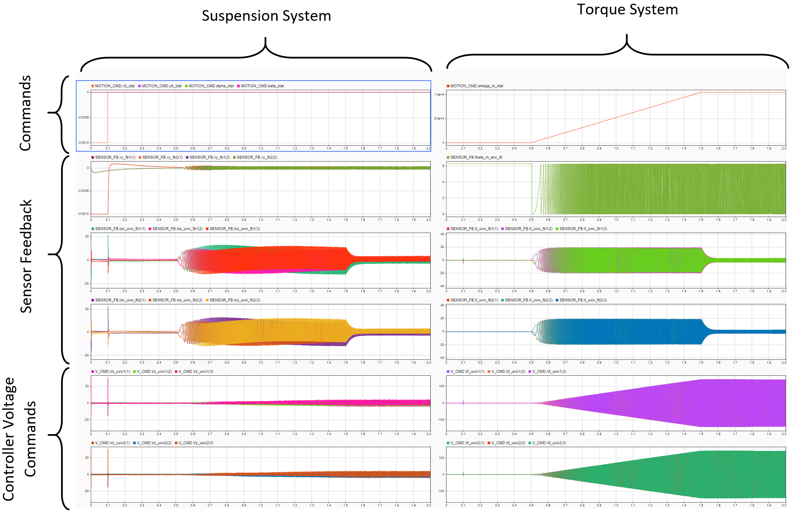

# BM Modeling

**Modeling of bearingless motors via simulation.**

## Introduction

This simulation package includes all the needed files to simulate the BP1 prototype bearingless motor. The Simulink files include a stand-alone simulation which includes both the plant model and a discrete-time controller. Both models are protected so they act as black boxes.

## Simulation

In the simulation file "TOP_LEVEL_SIM", the prototype machine starts at rest. First, the lift-off event occurs where the rotor is commanded to the center of the airgap, resulting in large suspension forces for a small time. After it is stably levitating, the rotor speed is accelerated to 100kRPM over one second.

The machine plant model includes force disturbances which model both rotor weight and rotor imbalance. The controller is implemented in discrete-time and runs every 1/20000 sec. The plant provides disturbance inputs which can be used to further verify the performance of the controller. Example disturbances are included in the Simulink file, but are disabled by default.

## Viewing Signals

The simulation signals can be easily viewed by loading the Simulink Data Inspector tool.

In this tool, load the included saved perspective "system_view.mldatx" file to see all the system signals. The default simulation output is shown below.

*Note: the Simulink files were created using R2019b; only the R2019b version can be used for running the models.*